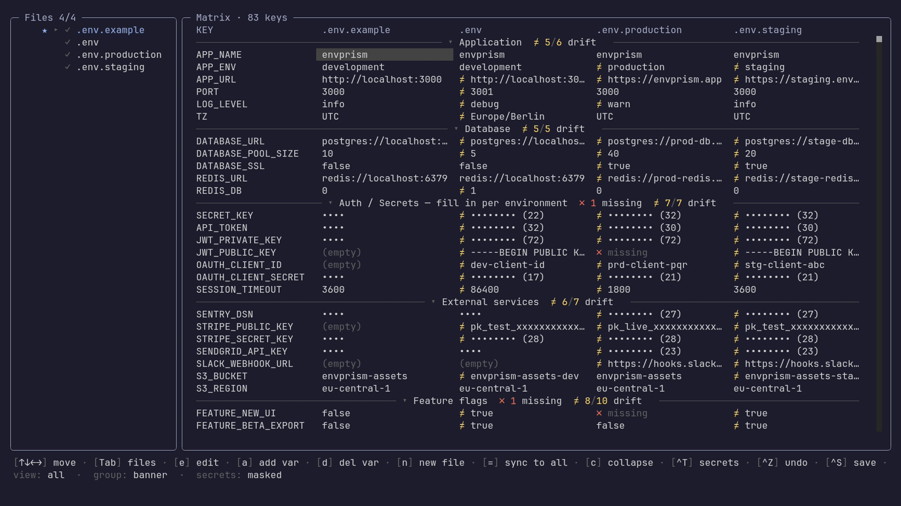

<div align="center">

# 🔻 envprism

**One set of variables, refracted into many environment views — a TUI for managing `.env*` files side by side**

[](https://www.npmjs.com/package/envprism)
[](https://www.npmjs.com/package/envprism)
[](https://github.com/TitusKirch/envprism/actions/workflows/ci.yml)
[](https://bun.sh/)
[](LICENSE)



</div>

---

```bash
bunx envprism
```

That's it. Point `envprism` at a directory containing `.env*` files and it opens a side-by-side matrix: rows are variable keys, columns are files. Differences light up, missing keys are obvious, and you can edit cells in place — comments, blank lines, and key order survive the round trip.

## 🤔 Why

Most projects accumulate a fistful of env files — `.env`, `.env.example`, `.env.staging`, `.env.production` — and no good way to see them together. You `diff` two at a time, miss the third, and ship a deploy where `REDIS_URL` was set everywhere except staging. The example file rots because nobody updates it when they add a key. Secrets get pasted into screenshots.

envprism treats the whole set as one thing: every file a column, every variable a row. The gaps jump out — this key is missing here, that value drifts there, this one is still a `CHANGEME`. Edits write back byte-exact, and secret values stay masked so the view is safe to share.

## 📦 Install & run

> [!IMPORTANT]
> envprism runs on **[Bun](https://bun.sh/)** 1.3+, not Node. The TUI links a native core via `bun:ffi`, so `npx envprism` will **not** work — [install Bun](https://bun.sh/) first.

```bash
bun add -g envprism     # install globally
bunx envprism           # …or run without installing
```

```bash
bunx envprism                      # open the TUI in the current directory
bunx envprism tui path/to/repo     # scan another directory
bunx envprism diff path/to/repo    # non-interactive drift report
bunx envprism diff --json | jq     # structured drift report
bunx envprism diff --check         # exit 1 if any file drifts from base (CI)
```

Inside the TUI, press `?` for the full keybinding reference.

## ✨ Features

- **🧮 Matrix view** — every `.env*` file becomes a column, every variable a row, so n-way differences are visible at a glance.
- **🎨 Diff at a glance** — per-cell icons flag values that differ, keys that are missing or extra, and unfilled placeholders like `CHANGEME`.
- **🙈 Secret masking** — token / secret / password-like values render as `•••• (N)`, so the matrix is safe to screen-share.
- **✏️ Edit in place** — edit any cell with `e`; editing a key a file doesn't have yet creates it. Also add (`a`), delete (`d`), and sync a value to every file (`=`).
- **💾 Byte-exact write-back** — `Ctrl-S` rewrites only the keys you changed; comments, blank lines, key order, quoting, and `export` prefixes survive intact.
- **📂 Sections & filtering** — group by comment banner or key prefix (`g`), fold sections (`c`), filter keys live (`/`), or show only drifting keys (`v`).
- **↩️ Undo** — `Ctrl-Z` walks back the last edits, adds, and deletes.
- **🧪 CI-friendly diff** — `envprism diff` prints a text or JSON (`--json`) drift report, or just sets an exit code (`--check`) for pre-commit hooks and CI.

<details>
<summary>Full feature list</summary>

### Discovery & comparison

- **🔍 Auto-discovery** — finds every `.env*` file in the current directory (or in `--paths a b c`); skips editor swap files and backups.
- **🧮 Matrix view** — rows are the union of every variable, columns are the files; the prism metaphor, literal.
- **🎯 Smart base resolution** — `.env.example` is auto-promoted to base if present, otherwise the alphabetically-first file. Override with `--base file`.
- **🎨 Per-cell diff icons** — `≠` value differs (yellow), `✗ missing` (red), `★` extra (key not in base, yellow), `⚠` placeholder (orange) — only the icon is coloured, values stay neutral.
- **🙈 Secret masking** — keys whose name contains `TOKEN`, `SECRET`, `PASSWORD`, `KEY`, `PRIVATE`, … render as `•••• (N)`; allow-list for `PUBLIC_*` and `*_ID`.
- **🕵️ Placeholder detection** — values like `TODO`, `FIXME`, `CHANGEME`, `xxx`, `your_secret_here`, `replace_me` flag a `⚠` so you know a secret was never filled in.
- **📂 Section grouping** — comment banners like `# === Database ===` (inline or three-line block, with `=`, `-`, `~`, `*`, or `#` separators) become section dividers; `g` toggles to grouping by key prefix (`APP_*`, `DB_*`).
- **🪗 Collapsible sections** — `c` folds the focused section; section dividers show drift count (`✗ 2 missing · ≠ 3/5 drift`) so you scan the worst groups first; `Shift-C` expands all.
- **🔎 Live filter** — `/` opens a popover that filters keys by substring, with a `matching N of M` counter.
- **🛣️ Drift-only view** — `v` hides keys that already agree with the base, so only the work-to-do remains.

### Editing & write-back

- **✏️ Edit-or-add** — `e` / `Enter` opens an edit popover on any cell; if the key isn't in that file yet, save creates it. The popover renders every file's current value as context next to the input.
- **➕ Add variable** — `a` walks key + value across two prompts; the key name is validated.
- **➖ Delete variable** — `d` removes the focused key from the focused file.
- **🆕 New `.env*` file** — `n` scaffolds a new file next to the base; saved with the rest on `Ctrl-S`.
- **🔁 Sync-to-all** — `=` copies the focused cell's value into every file (create or update); `Ctrl-A` inside the edit popover applies what you're typing to every file at once.
- **🟢 Modified marker** — every cell you touch this session gets a green `●`; clears on save so unsaved local work stands out from "this file just disagrees with base".
- **↩️ Undo** — `Ctrl-Z` walks back the last 50 edits / adds / deletes.
- **💾 Save** — `Ctrl-S` writes every dirty file. **Round-trip preserving**: comments, blank lines, key order, quoting, `export ` prefixes, and inline `#` comments survive byte-for-byte — only the keys you changed are rewritten.
- **⚠️ Quit guard** — `q` asks once before quitting if you have unsaved changes; `Ctrl-C` always force-quits.

### Navigation & panes

- **🧭 Two panes** — `Tab` switches between the matrix and the files sidebar; arrow-left at the leftmost matrix column hops into the sidebar.
- **☑️ Enable / disable files** — `Space` in the sidebar drops a file out of the matrix (without deleting from disk); `b` promotes the selected file to base (auto-enables it if disabled).
- **🖱️ Mouse** — wheel scrolls the matrix in both axes; the focused cell auto-scrolls into view when you reach the viewport edge.
- **❓ Help overlay** — `?` (or `ß` for QWERTZ) opens a keybinding reference; renders as a two-column grid on wide terminals and a single scrollable column on narrow / short ones.

### CI & scripting

- **🧪 `envprism diff`** — non-interactive subcommand that prints a text drift table, JSON (`--json`), or just sets the exit code (`--check`). Drop it into a pre-commit hook or CI to fail builds that drift from `.env.example`.

</details>

## ⚙️ Configuration

envprism runs zero-config. To tune defaults, drop an `envprism.config.{ts,js,mjs,json}` in your project — manage it with `bunx envprism config init | path | show | edit`. The file is resolved by walking **up from the current working directory** (override with `--config <path>` or `ENVPRISM_CONFIG`). For any setting, `flag > config > default`.

```ts
// envprism.config.ts
import { defineEnvprismConfig } from 'envprism/config';

export default defineEnvprismConfig({
  heuristics: { secretTokensExtra: ['WEBHOOK'], grouping: 'banner' },
  tui: { theme: { fgSection: '#5fd7d7' } }
});
```

List fields come in two flavours: the base field (e.g. `secretTokens`) **replaces** the built-in list, while the `…Extra` variant (e.g. `secretTokensExtra`) **appends** to it.

<details>
<summary>All configuration options</summary>

### `discovery`

| Option              | Default                | What it does                                            |
| :------------------ | :--------------------- | :------------------------------------------------------ |
| `paths`             | `['.']`                | Directories scanned when none are passed on the CLI.    |
| `skipSuffixes`      | `['.swp', '~', '.bak']`| Filename suffixes to skip (replaces the default list).  |
| `skipSuffixesExtra` | `[]`                   | Suffixes appended to `skipSuffixes`.                    |
| `exampleFirst`      | `true`                 | Sort `.env.example` first in the discovered file order. |

### `base`

| Option     | Default          | What it does                                                       |
| :--------- | :--------------- | :----------------------------------------------------------------- |
| `name`     | `'.env.example'` | Filename used as the diff base when present (overridden by `--base`). |
| `priority` | `[]`             | Ordered basenames tried as base before falling back to the first file. |

Base resolution order: `--base` flag → `base.name` → `base.priority` (in order) → first discovered file.

### `heuristics`

| Option              | Default                          | What it does                                              |
| :------------------ | :------------------------------- | :-------------------------------------------------------- |
| `secretTokens`      | `SECRET, TOKEN, PASSWORD, …`     | Key segments that mark a value as a secret (replaces).    |
| `secretTokensExtra` | `[]`                             | Secret tokens appended to the defaults.                   |
| `placeholders`      | `todo, fixme, changeme, …`       | Regex atoms flagging placeholder values (replaces).       |
| `placeholdersExtra` | `[]`                             | Placeholder atoms appended to the defaults.               |
| `grouping`          | `'auto'`                         | TUI grouping: `auto` (banner if present, else prefix), `banner`, or `prefix`. |

### `diff`

| Option          | Default | What it does                                          |
| :-------------- | :------ | :---------------------------------------------------- |
| `json`          | `false` | Emit JSON instead of the text table by default.       |
| `checkExitCode` | `1`     | Exit code used by `diff --check` when files drift.    |

### `tui`

| Option        | Default | What it does                                                    |
| :------------ | :------ | :-------------------------------------------------------------- |
| `theme`       | `{}`    | Partial `#rrggbb` overrides for the palette (see keys below).   |
| `layout`      | —       | Column/sidebar widths: `keyColWidth` (22), `valueColMin` (18), `sidebarWidth` (30), `rowGap` (0), `cellPadX` (1). |
| `undoLimit`   | `50`    | Max entries in the undo stack.                                  |
| `maskSecrets` | `true`  | Start with secret-suspect values masked (toggle in-app with `Ctrl-T`). |

Theme keys (all optional hex strings): `fg`, `fgDim`, `fgHeader`, `fgBase`, `fgSection`, `differs`, `extra`, `placeholder`, `modified`, `fgDirty`, `missing`, `focusBg`. Invalid hex values are ignored with a warning and fall back to the default.

</details>

> [!NOTE]
> The TypeScript types exported from `envprism/config` (`EnvprismUserConfig` and friends) are the canonical, always-current reference. A worked example lives in [`examples/envprism.config.ts`](examples/envprism.config.ts).

## 🤝 Contributing

PRs welcome. Conventional Commits required (enforced via commitlint). Husky runs the project's linters/formatters on `git commit`.

> [!TIP]
> Run `pnpm check:fix` before pushing — CI will catch what husky missed.

See [CONTRIBUTING.md](CONTRIBUTING.md) for the full workflow.

## 🛣️ Versioning

[Semantic Versioning](https://semver.org/) via [release-please](https://github.com/googleapis/release-please) — see [CHANGELOG.md](CHANGELOG.md).

## 📄 License

[MIT](LICENSE) © [Titus Kirch](https://github.com/TitusKirch/) / [IT-Dienstleistungen Titus Kirch](https://kirch.dev)
